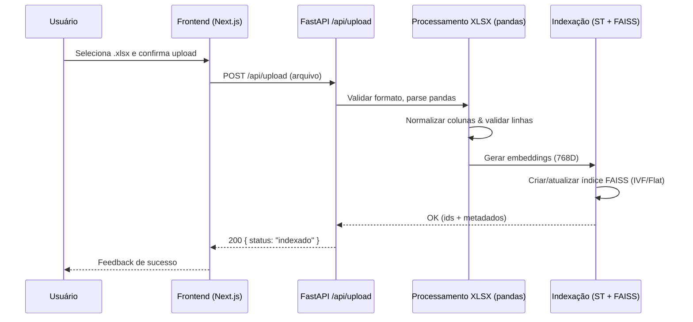
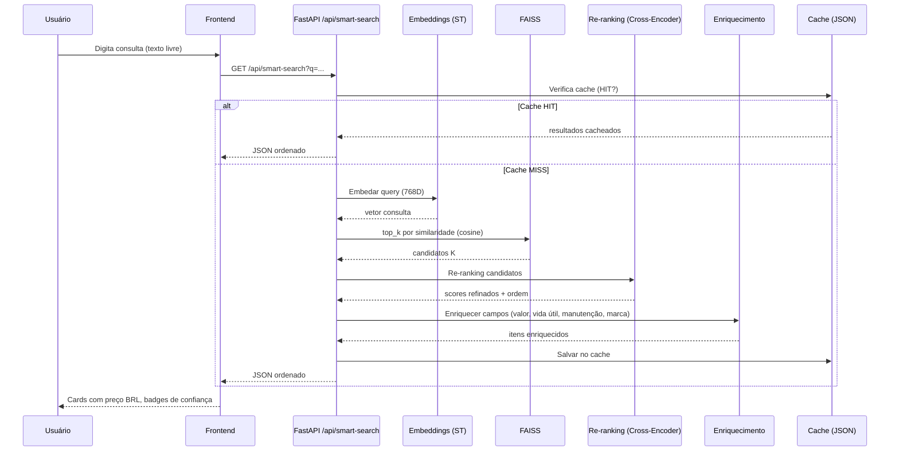
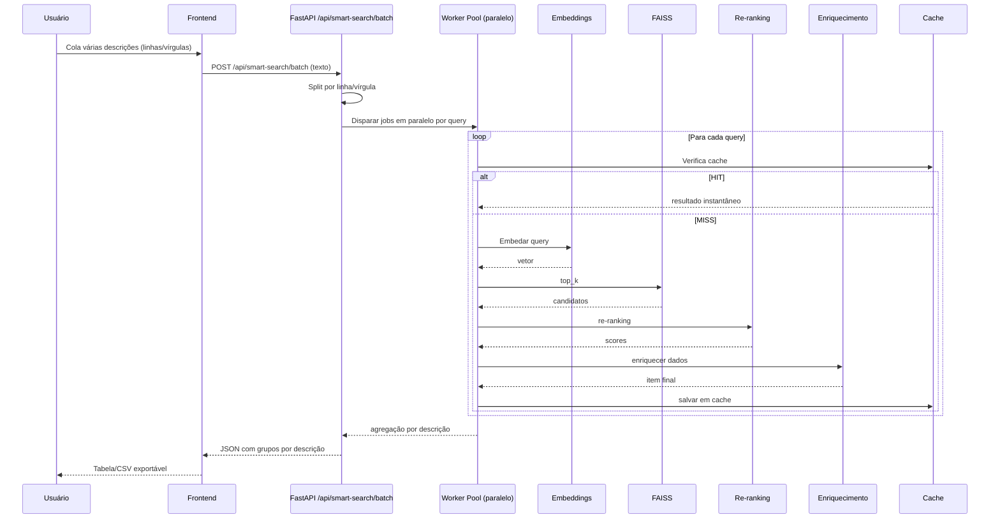
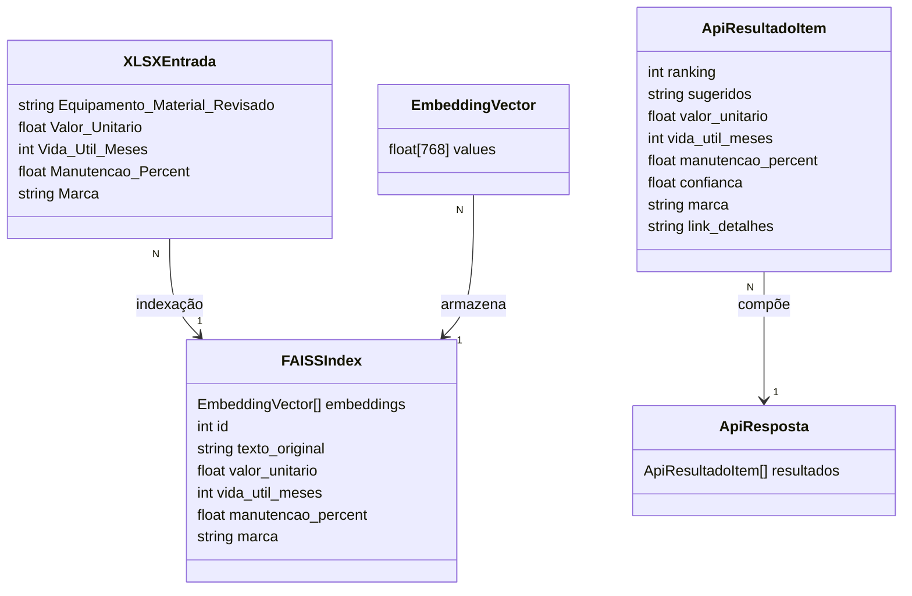

# 🧭 Fluxograma Completo da Arquitetura

```mermaid
%% =======================
%% ARQUITETURA - VISÃO GERAL
%% =======================
flowchart LR
  subgraph FE[Frontend (Next.js)]
    U[Usuário (UI Web)]
    UP[Upload Planilha (.xlsx)]
    BS[Busca Inteligente (Texto Livre)]
    RENDER[Renderização de Cards\n• EquipmentCard\n• Preço BRL • Badges\n• Indicadores visuais]
    ACOES[Interações do Usuário\n• Add ao carrinho • Seleção múltipla\n• Ver detalhes • Exportar CSV (batch)]
  end

  subgraph BE[Backend (FastAPI)]
    subgraph API[API Routes]
      R1[/api/upload/]
      R2[/api/data/status/]
      R3[/api/smart-search/]
      R4[/api/smart-search/batch/]
    end

    subgraph XLSX[Processamento XLSX]
      P1[Pandas DataFrame]
      P2[Normalização]
      P3[Validação]
    end

    subgraph IDX[Indexação Semântica]
      M1[Sentence Transformer\n(paraphrase-multi)]
      E1[Embeddings (768D)]
      FIDX[FAISS Index\n• IVF (Shards)\n• Flat Index]
    end

    subgraph SB[Sistema de Busca]
      Q1[1) Embedar Query\n(Sentence Transformer)]
      Q2[2) Busca Vetorial (FAISS)\n• Cosine • Top-K (5)]
      Q3[3) Re-ranking (Cross-Encoder)\n• score refinado]
      Q4[4) Enriquecimento de Dados\n• Valor unitário • Vida útil (meses)\n• Manutenção (%) • Marca/Modelo]
      Q5[5) Cache de Resultados\n• Query Cache (JSON)\n• Otimização]
    end
  end

  subgraph RESP[Resposta JSON]
    J1["{ resultados: [ { sugeridos, valor_unitario,\nvida_util_meses, manutencao_percent,\nconfianca, ranking, marca } ] }"]
  end

  U --> UP
  U --> BS
  UP --> R1
  BS --> R3
  BS -.batch.-> R4
  R1 --> XLSX
  XLSX -->|DataFrame limpo| IDX
  IDX --> FIDX
  R3 --> Q1 --> Q2 --> Q3 --> Q4 --> Q5 --> J1
  R4 --> Q1
  J1 --> RENDER --> ACOES
  classDef fe fill:#0ea5e9,stroke:#0369a1,color:#fff,stroke-width:1.5px;
  classDef be fill:#16a34a,stroke:#14532d,color:#fff,stroke-width:1.5px;
  classDef sub fill:#22c55e,stroke:#065f46,color:#fff;
  class FE fe
  class BE be
  class API,XLSX,IDX,SB sub
```

---

## 📤 1. Upload de Planilha



---

## 🔍 2. Busca Individual



---

## 📦 3. Busca em Lote



---

## 💾 4. Sistema de Cache

```mermaid
flowchart TD
  Q[Query recebida] --> CH{Cache HIT?}
  CH -- Sim --> R1[Retorna resultado imediato]
  CH -- Não --> P[Pipeline Busca\nEmbedding → FAISS → Re-ranking → Enriquecimento]
  P --> S[Salvar no Cache (JSON)]
  S --> R2[Retorna resultado]
```

---

## 🗂️ Estrutura de Dados


